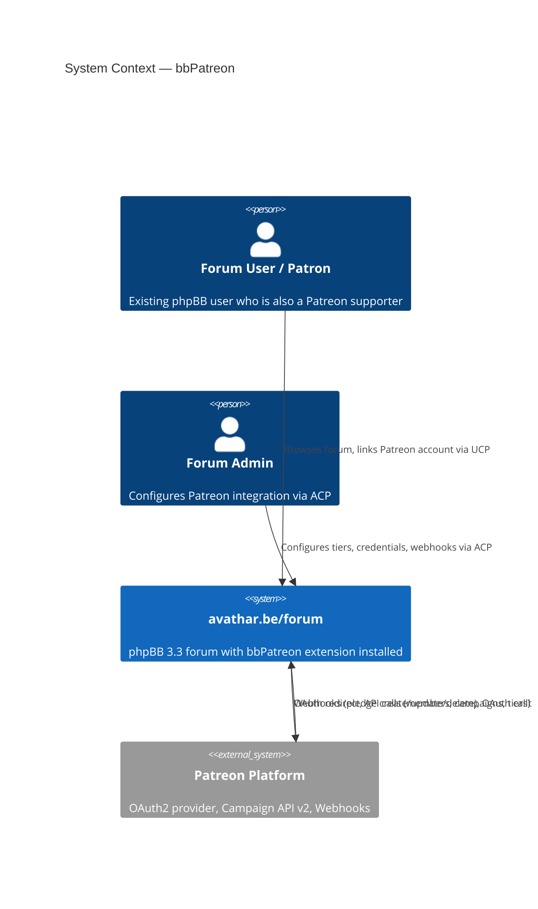
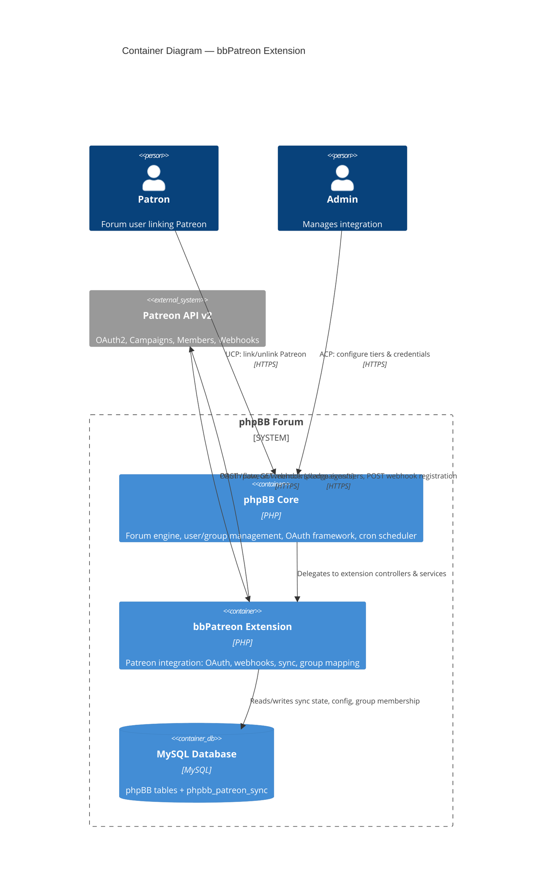
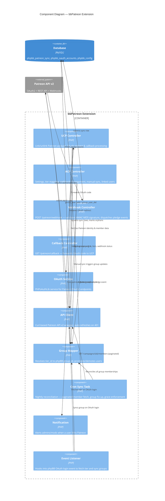
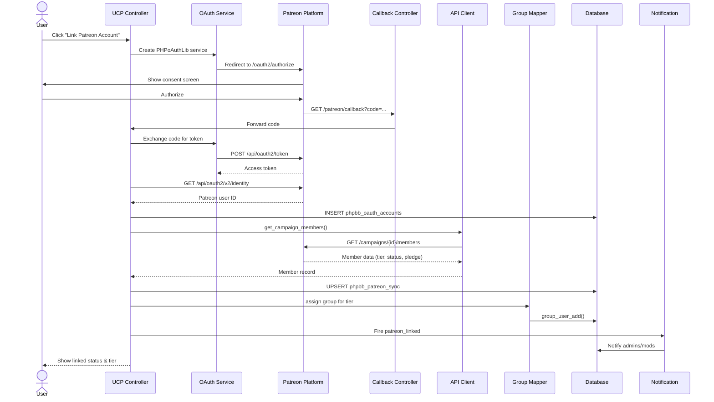
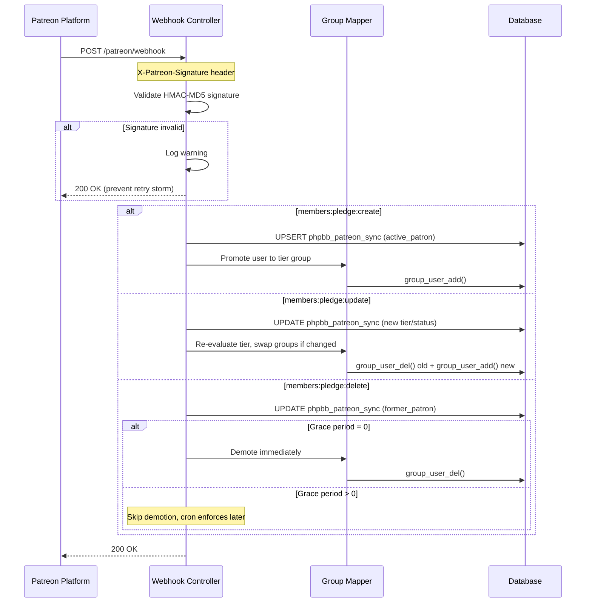
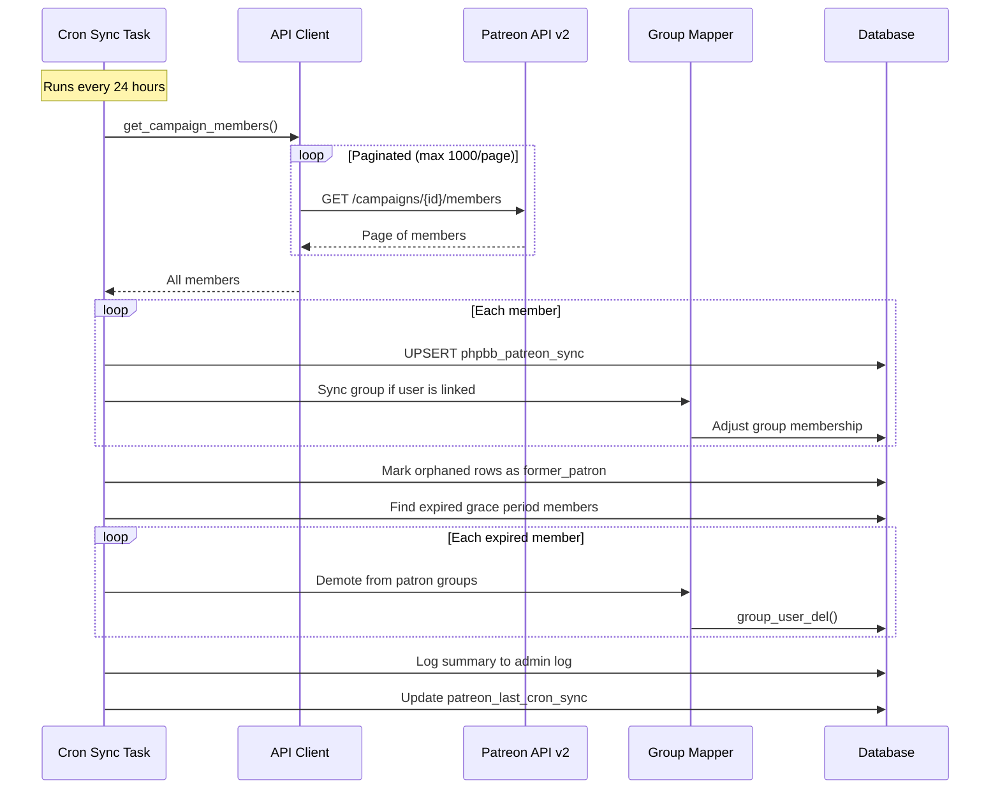

# bbPatreon — C4 Architecture Diagrams (Mermaid)

## C4 Context Diagram

## C4 Container Diagram

## C4 Component Diagram

## Flow: OAuth Linking

## Flow: Webhook Pledge Event

## Flow: Nightly Cron Reconciliation

